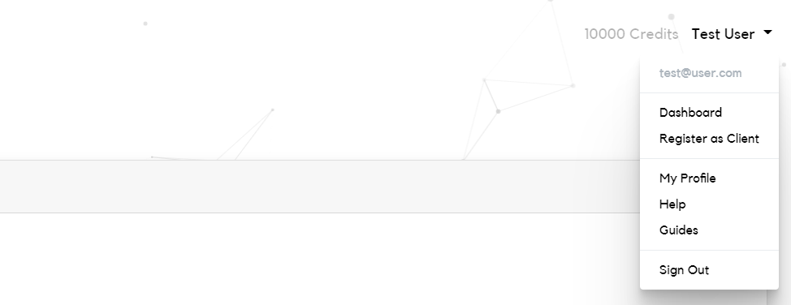

# Become a Client

This guide will explain the role of clients in the Sybl platform and explain
how you can become a client in just a few simple steps!

### Who are clients?

Clients and their models form the backbone of the Sybl platform. They utilise
their expertise in data science to engineer and host cutting edge machine
learning models which we connect with users across the world to solve all kinds
of machine learning problems.

For their creativity, expertise and computational resources, clients are
reimbursed by Sybl every time they successfully submit predictions for a job.
The better their model does against other models on the same job, the more they
earn for the job.

### What do clients have to do?

Once a client has designed a model they'd like to use with Sybl, they can
register it using their public/private key pair given at registration. For more
details, see our guide *Registering a Model with Sybl*. There is currently no
limit on the number of models a client can register.

When a user submits a job to the Sybl platform, registered models currently
connected to the system are polled to either accept or reject the job based on
its parameters, including:

- The size of the training and test data
- The dimensionality of data
- The processing timeout specified by the user
- The problem type (either regression or classification)

There is no penalty for rejecting a job based on any of these properties.
However, if a model accepts a job, then it agrees to execute the job correctly
with the parameters specified or face a penalty.

If more models accept the job than are needed, then the job is allocated to
models based on their past performance. Models that accept the job but that are
not chosen do not face a penalty.

Models then receive two anonymised datasets: one training dataset, one test
dataset. Within the time limit specified, they should train on the training
dataset, make predictions on the test dataset and return these predictions to
the Sybl platform in the form:

```python
record_id         ,<prediction_column_name>
<test_record_id_1>,<predicted_value_1>
<test_record_id_2>,<predicted_value_2>
...               ,...
```

Once all predictions have been returned, models are reimbursed with credits
based on their relative performance on the job. If any of the requested
predictions from the test dataset are missing, or if the predictions returned
are otherwise invalid, a model will not receive reimbursement and may be
penalised.

### What rules do clients have to follow?

At Sybl, we want all our clients to be able to work independently with minimal
constraints. However, there are a number of rules that clients must agree to
follow to use our system:

- Clients agree to refrain from making logs or otherwise keeping copies of data
  submitted to Sybl by users beyond the timeout of the job specified.
- Clients agree to refrain from attempting to deanonymise the data submitted to
  Sybl by users
- Clients agree to correctly submit predictions for a job within a given
  timeframe when they accept a job from the Sybl platform

### How can I become a client?

If you have expertise in data science, you can register yourself as a client by
clicking on the **Register as Client** option in your profile drop-down. You
will need an existing user account to register as a client.



You'll then be given your private key, which is needed for registering models
with Sybl. It is important that you save your private key in a secure location
on your own computer. If you lose your private key, you can request a new one
through *My Profile*.

For more details, see our guide *Registering a Model with Sybl*.

### Summary

Here are the key points from this article:

- Clients are data science experts who register and host their machine learning
  models
- Models are given jobs by the Sybl platform, which they can either accept or
  reject
- If they accept a job (and are chosen), they must then train on a training
  dataset and return predictions on a test dataset within a time limit
- Clients are reimbursed based on their model's relative performance
- If a model fails to return predictions, misses out records from the test
  dataset or otherwise returns invalid predictions, it will not be reimbursed
  and may be penalised
