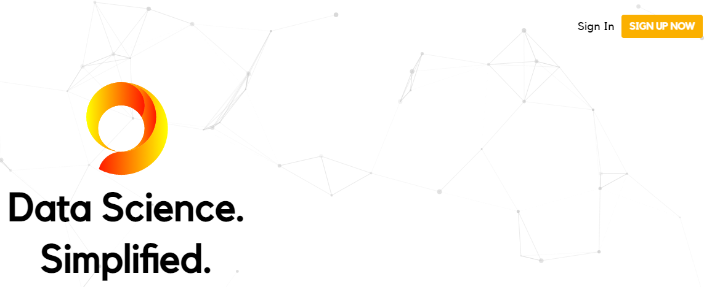
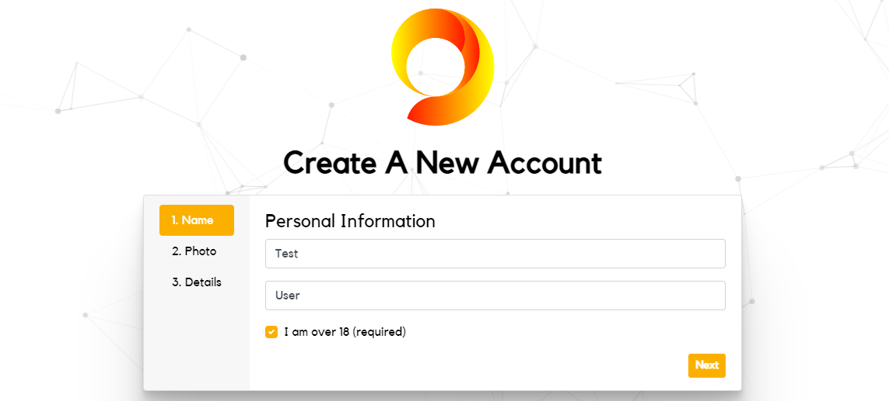
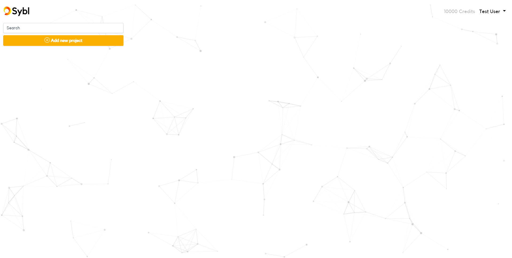
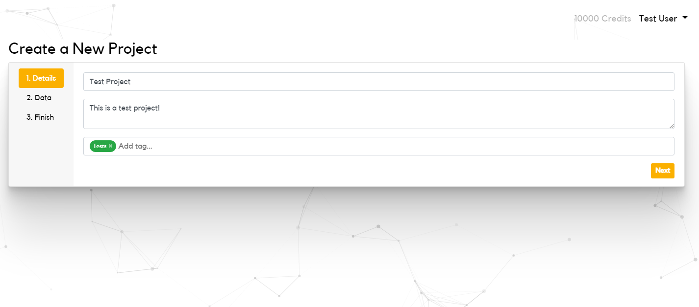
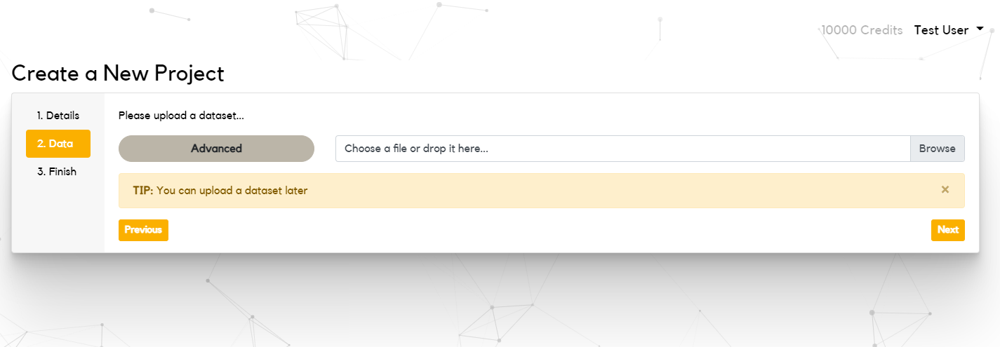
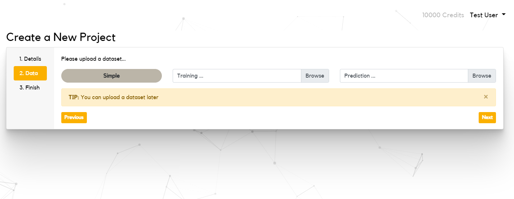
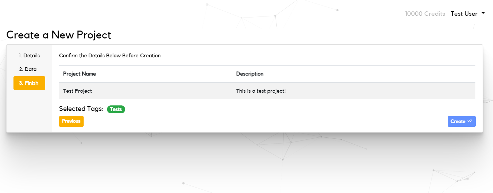
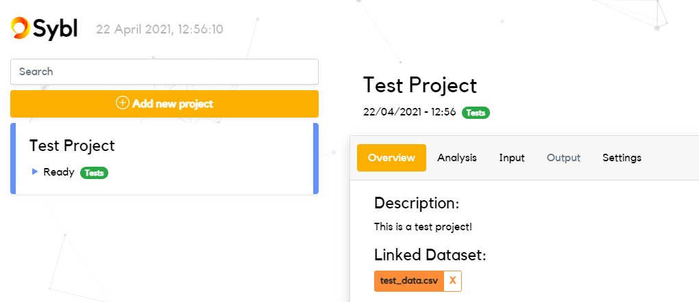
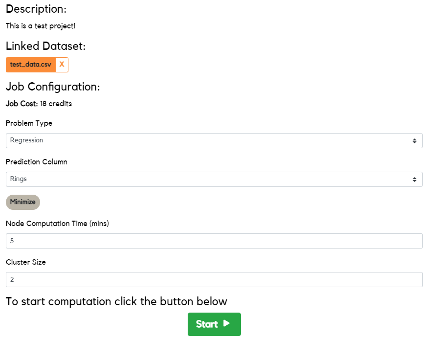
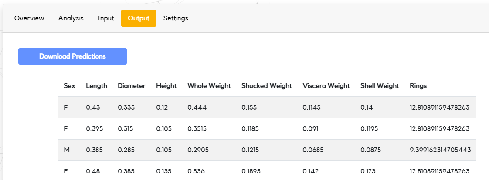

# Getting Started

This guide will help you get started with the Sybl platform, so you can get
access to the power of machine learning in less than ten minutes.

This guide is designed to help users (people who want to get predictions on
their data) get started with Sybl. If you're a machine learning expert who
wants to run your models with Sybl, see our guide *[Become a
Client](https://www.notion.so/Become-a-Client-581ccdc92e2946159ad94e3dec44f72e).*

### Registration

Visit [sybl.tech](https://sybl.tech) and register for an account in the top
right if you don't have one already.

### Creating a New Project

Once you've successfully registered for an account, you'll be redirected to
your dashboard.

This is where you'll find all of your uploaded datasets and machine learning
results!

To start a new project, click **Add new project**. You can give your project a
**Name,** **Description** and **Tags** if you want!

Once you've named your new project, click **Next** or **Data**. You'll be
prompted to upload a dataset.

You can choose to upload a single dataset with missing values, or separate
train and test datasets.

Click **Next** and finally **Create** to create your project.

### Start a Job

On your dashboard, your newly created project should be visible on the left
sidebar.

When you're ready to start a job, click on the project and select **Overview**.

You'll be asked to supply some configuration details for the job. These
include:

- **Timeout** - how long models should be allowed to run on your data
- **Cluster Size** - how many models should run on your data
- **Problem Type** - whether to predict using classification or regression (for
  more details, see our guide *Introduction to Machine Learning*)
- **Prediction Column** - the column of your data that should be predicted on

Once you've chosen values for these configuration details, click the green
button to submit your job. You'll be able to view the live progress of your
jobs through the dashboard. Once the job is finished, refresh the page to see
your predictions.

### Viewing Predictions

Once a job is complete, you'll be able to find the predictions made on your
data from the **Output** tab of your project.

You can view these in the browser or download them as a `.csv` file.
