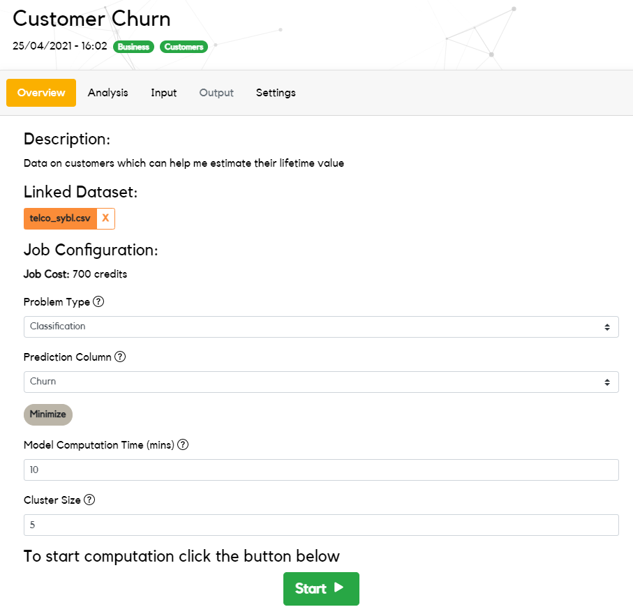
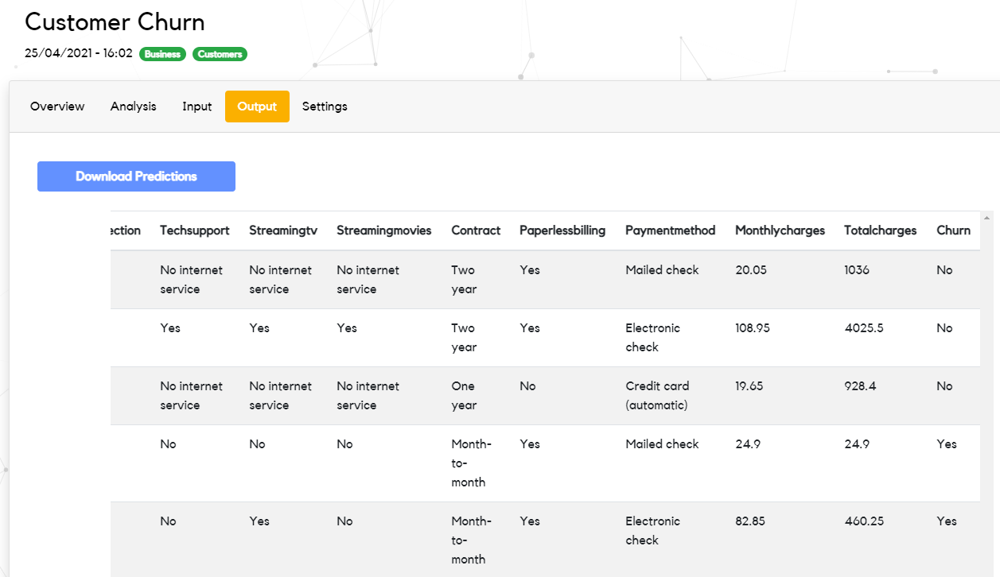

# How Sybl Works

This guide explains how Sybl works for both users and clients. After reading,
you'll understand the procedure Sybl uses to process a job on an uploaded
dataset.

### Users and Clients

Sybl users are people who want to use Sybl to get insights on their data. They
have the ability to upload data to the Sybl platform and pay to receive
predictions on their data.

Sybl clients are experts in data science who register their own machine
learning models on our network. Their models are used whenever a user submits a
job through Sybl.

### Creating Projects

A project is a user-created object in the Sybl dashboard which contains a
dataset and its associated prediction results.

A dataset is a pair of training data and prediction data files which can be
used by Sybl users to get insights on prediction data.

A job is an instance of a dataset being processed through the Sybl platform.
Multiple jobs can be executed on the same user project or dataset.



Once the project is created, a job can be submitted. A user can select:

- The duration of the job
- The number of nodes to use
- Whether their data needs classification or regression

The cost of a job is based on its size and the number of models requested by
the user.

### Processing a Job

Once a job is submitted, it gets passed to our control layer which keeps a list
of client models currently connected to Sybl. If enough available models are
connected to the system, the control layer will ask them whether they want to
accept the job.

Once enough models accept the job, the user's data is then fully anonymised to
protect any sensitive information from being disclosed to client models. All
user data is shuffled, obfuscated and partially randomised with differential
privacy to ensure the anonymity of their transferred data, and bootstrap
aggregation is used to give each model a different sample of the user's data.
All column names are also replaced to minimise the risk of linkage or
background knowledge privacy attacks.

```python
seller,         variety,    quantity
Alice's Apples, Pink Lady,  10
Bob's Barn,     Honeycrisp, 5
Bob's Barn,     Pink Lady,  2
...,            ...,        ...
```

```python
14d236, 7fe823, 25bc89
6a32b2, 1ebd4d, 0.067
32eab4, 1ebd4d, 0.6
6a32b2, 33abb2, 0.267
...,    ...,    ...
```

Once data has been safely anonymised, it is then sent to client models for
processing.

When a model receives a dataset, it must respond with predictions on the user's
prediction data before a given deadline. It must also respond to all prediction
rows given in the dataset; failure to do so will result in the penalisation of
the model.

### Collating Predictions

Different models may disagree on predicted values for certain rows of the
user's dataset. To collate the different predictions received for a job, we
consider each model's performance on the data.

A model's performance on the data is measured by hiding training examples in
the prediction data given to the model to predict on. The model is unaware
which rows of their dataset are real prediction examples and which are secretly
taken from the training examples.  These hidden training examples give us an
estimate for the model's performance on the real prediction examples (formally,
this is referred to as the validation accuracy).

The performance of each model is then used to generate a weighting for the
model, based on its performance against other models working on the same job.
Depending on the problem type, this weighting is used in different ways:

- In classification problems, predictions are chosen via a majority vote. A
  model's performance determines the number of votes that it may cast for any
  particular result.
- In regression problems, predictions are chosen via a weighted average. A
  model's performance determines its weighting in the average.

### Finishing a Job

Once all predictions have been collated, they are returned to the user and
displayed in their project.



Finally, clients whose models were used in the processing of the job are
reimbursed a proportion of the cost of the job based on their performance
against other models.

### Summary

Here are the key points from this article:

- Users are people who want to use Sybl to get insights on their data. Clients
  are people who register their machine learning models with Sybl to process
  users' data.
- When a user submits a job to Sybl, their data is fully anonymised before
  being distributed to clients for processing
- All models have their performance measured through validation accuracy; this
  performance is used to collate predictions
- Once a job has finished processing, users receive their final predictions and
  clients receive payment based on their performance - everyone wins!
